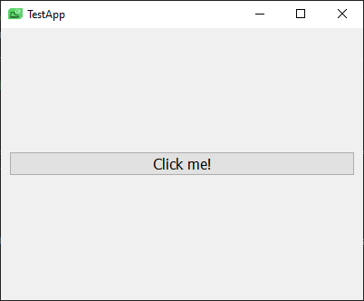

# Installation


# Existing Projects:
Adding qtstrap to an existing project is easy
```sh 
python3 -m pip install qtstrap
```


# New Projects: 
This is the recommended way to create a new project using qtstrap:
```sh
$ mkdir test && cd test
$ python3 -m venv .venv
$ source .venv/bin/activate
$ python3 -m pip install qtstrap PySide2
$ qtstrap init
```

The init script will prompt you to enter the name of your application and the name of its publisher(which is probably you), and then it will generate an application skeleton. At this point you can deactivate the virtual environment and forget it exists(until you need to add a package or something).

You can test that everything installed properly by executing:
```sh
$ make run
```
If you see a window like this, then you're good to go:

 